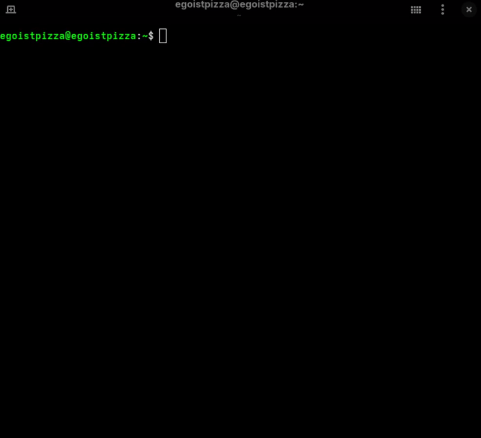

<p style="text-align: center;">
  <a href="https://www.gnu.org/licenses/gpl-3.0">
    
  </a>
  <a href="https://www.python.org/">
    
  </a>
  <a href="https://github.com/liquidslr/leetcode-company-wise-problems">
    
  </a>
  <a href="https://github.com/egoistpizza/LeetQuery/commits/main">
    
  </a>
</p>

# LeetQuery

A fast, offline search engine to find which companies ask specific LeetCode problems. This project queries a pre-built SQLite database (`problems.db`) for instant, local lookups.

## Demo

<p style="text-align: center;">
  
</p>

## Features

* **Fast Search:** Queries a pre-built SQLite database for instant results.
* **Simple & Offline:** Works entirely locally. No internet connection needed.
* **Easy to Use:** Simple, clean command-line interface.
* **Zero Setup:** No need to build any database; it's included in the repository.

## How It Works

This project works by querying a pre-built SQLite database (`problems.db`) that contains a comprehensive index of LeetCode problems and the companies that reportedly ask them.

The `search_app.py` script is a simple command-line interface that allows you to search this local database instantly.

## Installation

1.  Clone this repository to your local machine:
    ```bash
    git clone https://github.com/egoistpizza/LeetQuery.git
    ```

2.  Navigate into the project directory:
    ```bash
    cd LeetQuery
    ```
3.  That's it. You are ready to run the app.

## Usage

Ensure you are in the `LeetQuery` directory, then run the application:

```bash
python search_app.py
```
The app will launch and prompt you for a problem name.  

**Example:**

```text
-------------------------------------------------
LeetCode Company Search Engine
Database: problems.db
Type 'q' or 'exit' to quit.
-------------------------------------------------

Enter problem title to search: Two Sum

Companies asking for 'Two Sum':
  - Amazon
  - Apple
  - Google
  - Microsoft
  ...
```

## Project Structure

This repository contains only the necessary files to run the search:
```text
LeetQuery/
├── assets/
│   └── demo.gif
│
├── search_app.py   <-- The main search application
├── problems.db     <-- The pre-built problem database
└── README.md
```

## Data Source & Acknowledgements

The `problems.db` file included in this repository was generated using data from the `leetcode-company-wise-problems` repository, maintained by **liquidslr**. We are grateful for their work in compiling and sharing this data.
* **Source Repository**: https://github.com/liquidslr/leetcode-company-wise-problems
* **Database Snapshot Date:** The included database reflects the data from the source repository as of **June 20, 2025**.

## License

This project is licensed under the **GNU General Public License v3.0**.
